# MIT6.1810 Lab简记

the course is the new version of 6.828 and 6.s081（24 fall）

> [!IMPORTANT]
>
> 我们已经在你学长学姐的实验报告中多次看到类似的悔恨: 因为没有及时记录实验心得而在编写实验报告的时候忘记了自己经历趣事的细节. 为了和助教们分享你的各种实验经历, 我们建议你在实验过程中随时记录实验心得, 比如自己踩过的大坑, 或者是调了一周之后才发现的一个弱智bug, 等等.
>
> 我们相信, 当你做完PA回过头来阅读这些心得的时候, 就会发现这对你来说是一笔宝贵的财富.

在做PA的时候忽略了这一提醒，**因为没有及时记录实验心得而忘记了自己经历趣事的细节** :sob:所以牢记教训简单记录Lab的完成过程

- [MIT6.1810 Lab简记](#mit61810-lab--)
  * [Lab1. Util](#lab1-util)
  * [Lab2. Syscall](#lab2-syscall)
    + [1. debug & gdb](#1-debug---gdb)
    + [2. strace](#2-strace)
    + [3. attack](#3-attack)
      - [attacktest.c](#attacktestc)
      - [secret.c](#secretc)
      - [attack.c](#attackc)
      - [xv6内存管理](#xv6----)
        * [fork](#fork)
        * [exec](#exec)
        * [sbrk](#sbrk)
        * [wait](#wait)
      - [Answer](#answer)
    + [Some concepts](#some-concepts)
  * [Lab3. Pgtbl](#lab3-pgtbl)
    + [1. Inspect pgtbl](#1-inspect-pgtbl)
    + [2. speed syscall](#2-speed-syscall)
    + [3. print pgtbl](#3-print-pgtbl)
    + [4. superpages](#4-superpages)
  * [Lab4. Traps](#lab4-traps)
    + [1. RISC-V asmma](#1-risc-v-asmma)
    + [2. backtrace](#2-backtrace)
    + [3. alarm](#3-alarm)
    + [Some concepts](#some-concepts-1)
  * [Lab5. Cow](#lab5-cow)
    + [cow工作原理](#cow----)
    + [Answer](#answer-1)
    + [关于调试](#----)
    + [Some concepts](#some-concepts-2)
  * [Lab6. Net](#lab6-net)
  * [Lab7. Lock](#lab7-lock)
    + [1.  memory allocator](#1--memory-allocator)
    + [2.  buffer cache](#2--buffer-cache)
      - [deepseek:](#deepseek-)
  * [Lab8. Fs](#lab8-fs)
    + [1. large files](#1-large-files)
    + [2. symbolic links](#2-symbolic-links)
  * [Lab9. mmap](#lab9-mmap)

<small><i><a href='http://ecotrust-canada.github.io/markdown-toc/'>Table of contents generated with markdown-toc</a></i></small>


## Lab1. Util

## Lab2. Syscall

### 1. debug & gdb

some useful debugging tips and tools

- backtrace(bt)
  - frame [num/up/down]
  - info locals/args
- kernel/kernel.asm
- addr2line
- script

- qemu monitor [ctrl-a-c]

### 2. strace

The entire system call process

### 3. attack

目前最难的部分，不合理的是它把这个lab放在页表之前，如果没看过页表这里肯定做不出来；但合理的是页表只涉及最基本的，更主要的部分是system call和页表的结合。

这个lab的精巧之处在于将attack xv6作为引子，通过与虚拟内存相关知识串起了fork exec sbrk等sysctem call，可以基本了解xv6的虚拟内存管理、用户进程内存的排布以及和kernel的交互。

用户进程处涉及到了主要三个文件attacktest.c,attack.c,secret.c

#### attacktest.c

先使用fork创建新进程，并通过exec系统调用执行secret.c写入秘密


再使用fork创建新进程，并通过exec系统调用执行attack.c找到先前在内存写入的秘密


#### secret.c

使用sbrk系统调用申请内存空间后，通过end在内存写入秘密，写入的位置在申请的位置之后 PGSIZE*9+32 处


#### attack.c

需要在attack.c找到之前写入的秘密进行attack，关键在理清xv6对虚拟内存的管理分配并在这个新进程找到之前写入的物理内存页


#### xv6内存管理

attacktest.c运行secret.c和sh.c运行attacktest.c一样都是通过`fork`和`exec`来执行一个新的程序

这里以建立secret.c为例，从系统调用来看xv6的内存管理

##### fork

`fork`涉及到的内存分配主要是`allocproc`和`uvmcopy`


`allocproc`为先为进程分配物理内存并建立页表映射，一共分配了四页，`allocproc`后实现了操作系统管理进程的一个页表，页表管理了进程的虚拟内存映射

（目前映射了`trapoline`（虚拟内存地址最大处）和`trapframe`（`traponine`之下））

- `trapframe`一页
- `pagetable`一页 （`proc_pagetable`中`uvmcreate`函数分配）
- 容易遗忘的是xv6运行在Sv39 RISC-V上,使用三级页表，在建立`trapoline`和`trapframe`的虚拟内存映射时需要分配两个物理内存页用作页目录


`uvmcopy`给定父进程的页表，将其内存复制到子进程的页表中。（父进程分配了多少物理页，子进程也分配同样大小并复制，并在虚拟内存最低处建立映射）这里分配了6页（四页物理内存复制，两页用作页目录）


##### exec

`exec`要做的就是载入elf文件并执行

在`exec`的实现中，会使用`proc_pagetable`创建新的页表来替换旧页表（`exec`作用就是替换整个程序镜像，相当于从头开始执行一个新的程序，之前程序的相关内容全部丢弃）`proc_pagetable`会分配3页

接着，`exec`遍历elf文件的program header，将LOAD段加载进内存中。具体是通过`uvmalloc`分配物理内存，`loadseg`将段加载进内存。xv6程序的elf文件包含两个LOAD段，data段和text段，可以通过readelf看一下.这两个段分别加载到虚拟内存的第0页和第1页中。同理，这两页属于低地址的用户内存，需要4页（2页目录+2页物理页）来分别存放这两个段


另外还用为用户堆栈分配内存，第一个页面作为堆栈保护而不可访问，其余页面用作用户堆栈.这里分配2页


`exec`结束后需要释放旧页表和旧用户内存，其中的两个`uvmunmap`释放pte映射（避免后续`uvmfree`的时候意外释放trampoline和trapframe的物理内存），并不释放物理页，因为trampoline是整个操作系统共享的不需要释放，而trapframe是用户态和内核态转换时的用到的存储区域，十分重要，同样不会释放（关于trapframe和trampoline的详细说明可以查阅book-riscv）。最后的`uvmfree`则是释放旧页表占用的内存（5页）以及用户内存（4页），共9页。

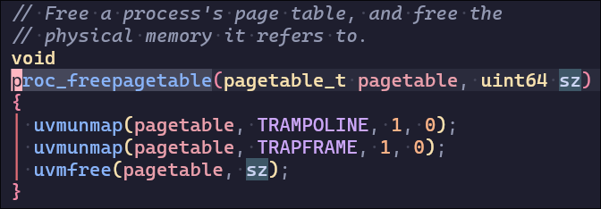

综上，`exec`一共分配了3+4+2=9页，然后又释放了9页。

##### sbrk

`sbrk`通过`growproc`分配物理页并建立映射，分配的是堆，从低地址向上增长


##### wait

进程内存的释放不在exit中而在wait，由父进程发起，这里需要注意free的顺序，因为xv6的空闲内存由freelist管理，通过kalloc分配物理页，kfree释放物理页，并将释放的物理页指向当前的freelist，实现类似栈的后进先出来分配物理页


先调用`uvmunmap`从低到高地址释放用户内存，根据之前内存分配的分析，释放顺序为data段+text段、用户栈+page guard、32页堆内存（每页从低地址页到高地址页依次释放/入栈），共36页

最后释放页表，共5页（5个页目录）

此时我们可以知道，`kmem`维护的空闲链表栈，从栈顶开始的页依次为：5页页表、第32页堆内存、第31页堆内存、...、第10页堆内存（密码所在的页）、...、第1页堆内存、page guard.....trapframe


#### Answer

attacktest运行attack的方式和运行secret的一样，都是通过`fork`+`exec`，直接拿前面的分析结果，我们知道在开始执行attack程序之前，fork分配了10页，exec分配9页又释放了9页，其中fork分配的10页来自于5页页表、第32 ~ 28页堆内存，exec分配的9页来自第27 ~ 18页堆内存，后面又释放了9页回栈顶，此时栈顶开始的页依次为：9页、第17页堆内存、...、第10页堆内存,秘密就在第17页中（秘密在第10页堆内存处）。

- 另外一个 Question：`user/secret.c` copies the secret bytes to memory whose address is 32 bytes after the start of a page. Change the 32 to 0 and you should see that your attack doesn't work anymore; why not?

- 为什么将秘密的页内offset改成0就不行了只有>=32的值才行，是因为系统把空闲页前4个字节作为链式栈的指针了，所以覆盖掉了秘密的值

### Some concepts

1. stack frame

栈帧（Stack Frame）是程序运行时在调用栈（Call Stack）上分配的一段内存区域，用于管理**函数调用**的上下文信息。它是函数执行期间临时数据的存储空间，也是实现函数嵌套调用、返回和局部变量管理的核心机制。

```
高地址 -> | 调用者栈帧 | 
          | 当前栈帧   | <- 栈顶（esp/sp）
低地址
```

2. ecall

```
User Program           Kernel/Handler
↓
1. 准备参数：
   - 系统调用号写入 a7
   - 参数写入 a0, a1, ...
2. 执行 ecall
   ↓
→ 3. CPU 切换到更高特权级
   ↓
→ 4. 保存上下文：
     - PC（程序计数器）存入 sepc
     - 异常原因存入 scause
     - 当前状态存入 sstatus
   ↓
→ 5. 跳转到 stvec 寄存器指向的陷阱处理程序
   ↓
6. 内核处理系统调用
   ↓
7. 执行 sret 返回用户程序
```

3. register a7

直接通过汇编指令写入

通过高级语言封装函数写入

```
#include <unistd.h>
int main() {
    char msg[] = "Hello\n";
    // 等价于汇编中的 li a7, 64
    syscall(SYS_write, 1, msg, 6);  // SYS_write=64
    return 0;
}
long syscall(long num, ...) {
    register long a7 asm("a7") = num;  // 强制将 num 存入 a7
    register long a0 asm("a0");        // 返回值通过 a0 接收
    asm volatile (
        "ecall"
        : "=r"(a0)
        : "r"(a7), "r"(a0), "r"(a1), "r"(a2)  // 参数依次存入 a0-a2
        : "memory"
    );
    return a0;
}
```

4. addrline

```bash
$ addr2line -e my_program 0x401152
> /path/to/my_program.c:123
```

| 选项 | 作用                                                        |
| :--- | :---------------------------------------------------------- |
| `-f` | 显示函数名（不仅显示文件名和行号）。                        |
| `-C` | 解码 C++ 符号（demangle，将编译器生成的符号转为可读名称）。 |
| `-p` | 以可读格式输出（包含文件名、行号和函数名）。                |
| `-a` | 显示原始地址（在输出中添加地址信息）。                      |
| `-i` | 显示内联函数（如果存在内联展开）。                          |

5. script

```bash
$ script qemu_output.log  # 指定日志文件名（默认是 typescript）
$ make qemu 所有输出（包括内核日志、调试信息）将被实时记录到 qemu_output.log
$ exit
```

6. trapframe

`trapframe` 是一个结构体，用来保存处理器的上下文信息，特别是在发生中断或陷阱（trap）时。当CPU被中断或陷入某个异常（例如系统调用、页错误等）时，操作系统需要保存当前执行的状态，以便后续恢复程序的执行。

在xv6中，`trapframe` 主要用于以下两种情况：

1. **中断处理**：当发生硬件中断（例如时钟中断或外部设备中断）时，当前执行上下文需要被保存到 `trapframe` 中，以便在中断处理完毕后能够恢复到中断发生前的状态。
2. **系统调用处理**：在系统调用过程中，CPU会产生一个陷阱（trap），这时也需要保存当前用户程序的执行上下文，等系统调用处理完毕后，再恢复到用户程序继续执行。

`trapframe` 的结构通常包含了以下几个关键部分：

- **寄存器状态**：包括程序计数器（PC）、栈指针（SP）以及其他通用寄存器的值。
- **中断相关标志**：如中断号、异常号等。
- **用户栈信息**：在发生系统调用或中断时，栈的状态信息也会被保存。

## Lab3. Pgtbl

### 1. Inspect pgtbl

可以用Lab2中`exec`系统调用做了什么来解释页表

### 2. speed syscall

像`trapoline`和`trapframe`一样分配物理页并在页表进行映射，注意需要在`exec`和`fork`实现中给pid赋值并且在`proc_freepagetable`处调用`uvmunmap`

我还修改了`struc proc`的定义，增加`usyscall`与`trapframe`的风格一致


就不该让我管理内存:sob:最后的`usertest`一直过不去结果发现是第二部分的`usyscall`的page没有释放


这样之后`usertest`也没过，还少两个page，`usyscall`的内存不能在`proc_pagetable`分配，只能在`alloc_proc`分配，可能与锁有关，目前我还不知道原因

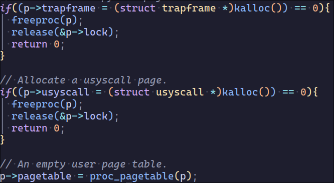

### 3. print pgtbl

这个题目MIT将其设为easy，但是课程官网上给出的答案中的`va`却是错误的，并且我也模拟出了错误的原因(往年的lab没有要求打印va)

这是得到官网答案的代码：(你能不能发现问题所在..

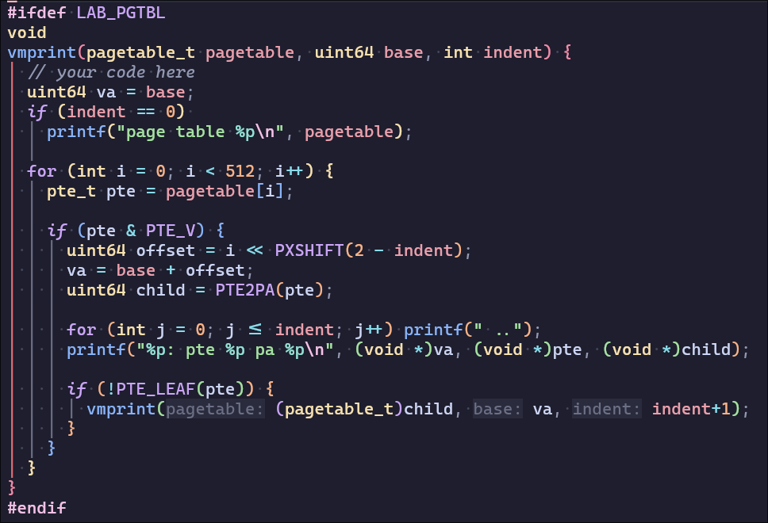

这是得到正确答案的代码：（没错，i溢出了，offset会在几个数之间循环

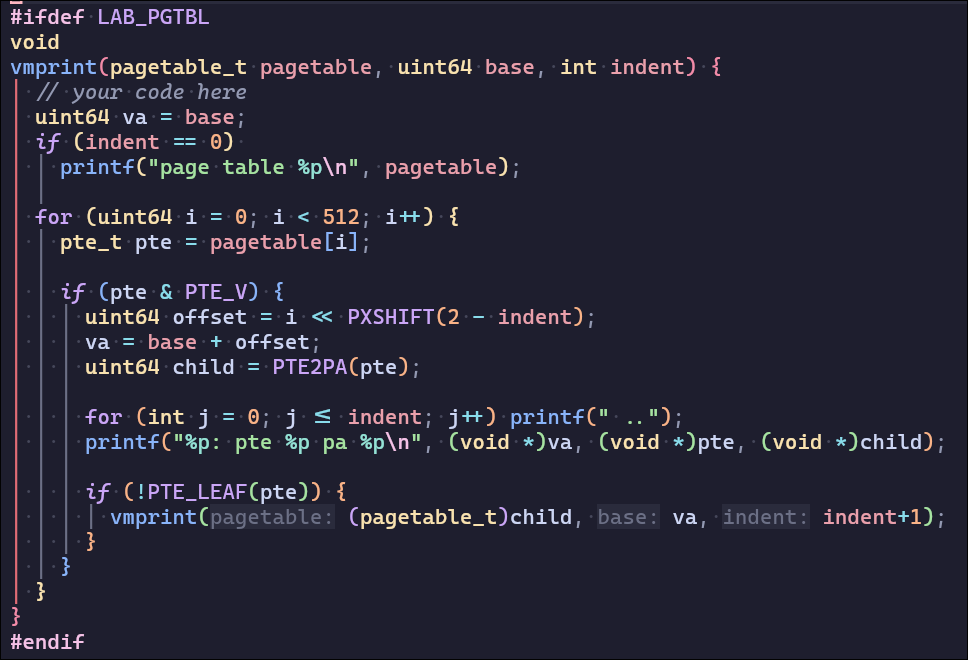

这是我得到的答案，我用MAXVA验证了它的正确性

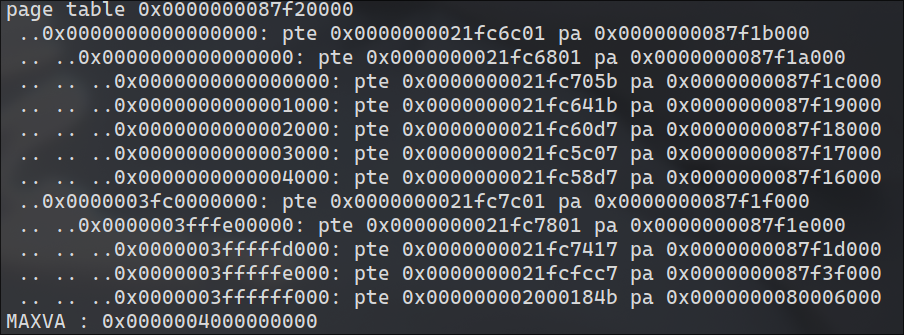

### 4. superpages

这个部分需要让xv6支持超页面，改动的地方较多，容易出现小错误，结果输出对了`usertest`也不一定能过

首先需要让xv6能够分配超页面物理内存，为了便于管理，我在`kmem`中增加了`superfreelist`,并在init时初始化（需要注意字节对齐

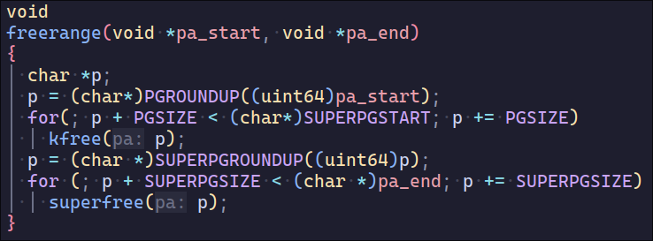

然后需要让sbrk支持超页面的分配，这部分很容易出问题

1. 因为需要字节对齐，可能导致分配超页面的起始地址较大，与之前的sz中间需要分配虚拟地址
2. 只设定了少量的超页面，如果申请物理内存较大，只能使用普通页面
3. 如果申请的物理内存过大，需要`dealloc`之前alloc过的内存并`unmap`

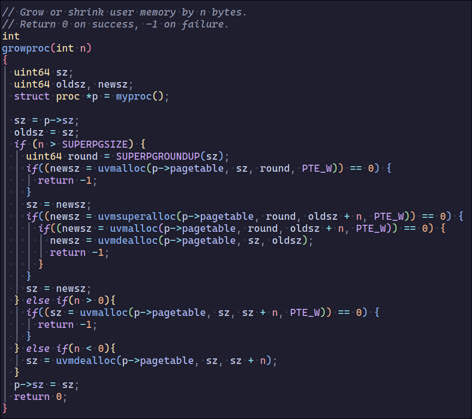

之后和`uvmalloc`一样分配超页面，开始我想把两者封装在一起，发现还是独立函数更为清晰

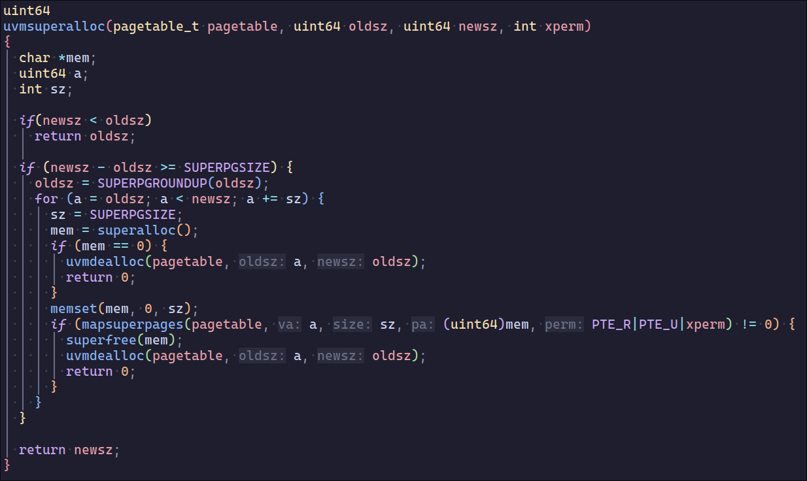

之后比较关键的是页表映射，需要让level1的pte直接映射到物理内存而不是下一级的pte，相当于没有了L0但多了9位的offset，这里主要改动的是`walk`


另外还要让超页面支持`fork`子进程时的页表复制和释放，这里直接封装到一个函数了


## Lab4. Traps

### 1. RISC-V asmma

- Which registers contain arguments to functions? For example, which register holds 13 in main's call to `printf`?

  - a0-a7

- Where is the call to function `f` in the assembly code for main? Where is the call to `g`? (Hint: the compiler may inline functions.)

  - ```assem
    2e:	45b1                	li	a1,12
    1a:	250d                	addiw	a0,a0,3
    ```

- Run the following code.

  ```c
  unsigned int i = 0x00646c72;
  printf("H%x Wo%s", 57616, (char *) &i);
  ```

  What is the output?

  - `He110 World`，RISC-V 和 x86 都是小端字节序

- In the following code, what is going to be printed after `'y='`? (note: the answer is not a specific value.) Why does this happen?

  ```c
  printf("x=%d y=%d", 3)；
  ```

  - ub

### 2. backtrace

模拟实现backtrace，理解栈帧就很容易实现

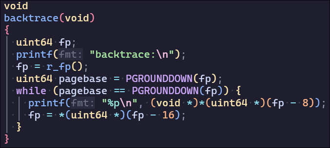

### 3. alarm

这题难度为hard，但实现起来没有很难，而且官方给了很多提示，就差直接说答案了

首先要支持新加入的`syscall`，这部分Lab1就涉及了

然后就是实现两个`syscall`来实现alarm，alarm的功能类似与设定一个固定时长的时钟中断，并且它的实现ticks计数也以物理时钟中断为基本单位

首先需要为`proc`增加一个alarm相关的结构体（`enabled` 代表是否启用alarm，`ticks` 为计数值， `using`代表是否正在处理alarm中断不能重复中断，`copy`为中断前的寄存器，`handler`为中断处理函数，`isreturn` 需要为恢复a0提供支持）


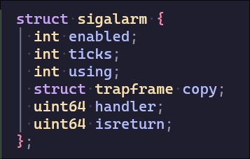

`sys_sigalarm`用于启用alarm，且在赋值为`(0，0)`时关闭alarm

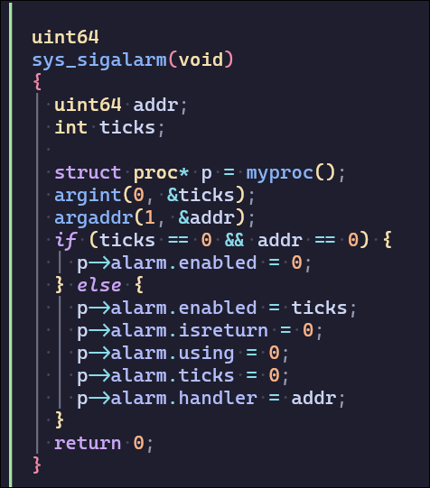

然后需要在`usertrap`中提供alarm的支持，每次时钟中断将ticks值加一，在达到计数值后设置`epc`寄存器调用handler，并且需要保存寄存器，在用户处理完alarm中断后恢复(在`sigreturn`中实现

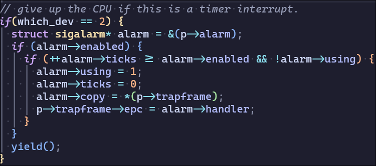

在`sigreturn`中恢复寄存器，`sigreturn`的返回值会被保存在a0中，需要重新赋值

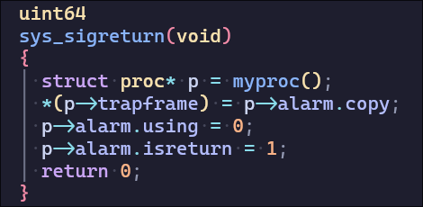


### Some concepts

1. 栈帧

These [lecture notes](https://pdos.csail.mit.edu/6.1810/2023/lec/l-riscv.txt) have a picture of the layout of stack frames. Note that the return address lives at a fixed offset (-8) from the frame pointer of a stackframe, and that the saved frame pointer lives at fixed offset (-16) from the frame pointer.

https://decaf-lang.github.io/minidecaf-tutorial-deploy/docs/lab5/stackframe.html

---

## Lab5. Cow

这个lab需要实现copy-on-write fork，先阅读Chapter4.6 的page-fault exceptions 了解cow机制，然后根据提示实现功能的各个部分。不过和`superpage`一样如果发生了小错误debug很麻烦，容易发生令人费解的错误

### cow工作原理

许多内核使用页面故障来实现**写时复制（copy-on-write，cow）fork**。要解释写时复制fork，可以想一想xv6的`fork`，在第3章中介绍过。`fork`通过调用`uvmcopy`（kernel/vm.c:309）为子进程分配物理内存，并将父进程的内存复制到子程序中，使子进程拥有与父进程相同的内存内容。如果子进程和父进程能够共享父进程的物理内存，效率会更高。然而，直接实现这种方法是行不通的，因为父进程和子进程对共享栈和堆的写入会中断彼此的执行。

通过使用写时复制fork，可以让父进程和子进程安全地共享物理内存，通过页面故障来实现。当CPU不能将虚拟地址翻译成物理地址时，CPU会产生一个页面故障异常（page-fault exception）。 RISC-V有三种不同的页故障：load页故障（当加载指令不能翻译其虚拟地址时）、stote页故障（当存储指令不能翻译其虚拟地址时）和指令页故障（当指令的地址不能翻译时）。`scause`寄存器中的值表示页面故障的类型，`stval`寄存器中包含无法翻译的地址。

***COW*** fork中的基本设计是父进程和子进程最初共享所有的物理页面，但将它们映射设置为只读。因此，当子进程或父进程执行store指令时，RISC-V CPU会引发一个页面故障异常。作为对这个异常的响应，内核会拷贝一份包含故障地址的页。然后将一个副本的读/写映射在子进程地址空间，另一个副本的读/写映射在父进程地址空间。更新页表后，内核在引起故障的指令处恢复故障处理。因为内核已经更新了相关的PTE，允许写入，所以现在故障指令将正常执行。

这个COW设计对`fork`很有效，因为往往子程序在fork后立即调用exec，用新的地址空间替换其地址空间。在这种常见的情况下，子程序只会遇到一些页面故障，而内核可以避免进行完整的复制。此外，COW fork是透明的：不需要对应用程序进行修改，应用程序就能受益。

这段来自xv6 boot 4.6的翻译（from [xv6 book-cn](https://github.com/zhenyu-zang/xv6-riscv-book-Chinese/blob/main/Chapter-4.md)），对于cow已经写的很清楚了,另外：RISC-V有三种不同的页故障对应scause，对于Cow只需要处理scause=15的page-fault

- **指令Page Fault**（取指）：`scause = 12`
- **加载Page Fault**（读数据）：`scause = 13`
- **存储Page Fault**（写数据）：`scause = 15`

### Answer

首先需要增加支持Cow的物理内存引用计数，使得不会free共享的页面，增加减少需要上锁防止多个进程共同写入，同时我把`subreference`封装进`kfree`，减少需要修改的框架代码

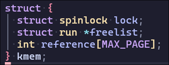


然后实现Cow-fork修改`uvmcopy`，主要有几个关键点：

- 不分配物理页

- 使用pte的RSW保留位，增加`PTE_COW`用于标示page-fault时需要处理的页表项
- 将父进程和子进程的页表都标记为不可写
- 需要加入`*pte & PTE_COW`防止还没有复制可写子进程页就调用fork


然后需要`usertrap`处理`scause`为15的pagefault（ps：不要随便加看不懂的内容，我开始在这里手欠加入了上面处理`syscall`的`intr_on`，又导致了无法理解的错误）


另外需要在`copyout`中加入同样的机制，防止误判页不可写入


### 关于调试

> [!IMPORTANT]
>
> - The machine is always right. (机器永远是对的)
>   - Corollary: If the program does not produce the desired output, it is the programmer's fault.
> - Every line of untested code is always wrong. (未测试代码永远是错的)
>   - Corollary: Mistakes are likely to appear in the "must-be-correct" code.
>
> 这两条公理的意思是: 抱怨是没有用的, 接受代码有bug的现实, 耐心调试.

这个bug卡了我几个小时..


首先需要定位发生`usertrap`的位置，这里我犯了第一个错误，想当然认为`copyout`只在pipe中使用，起手gdb`b sys_pipe`，其实错误发生在fork前的read

紧接着我犯了第二个错误，我继续起手gdb `b sys_read`,其实我还没有看read系统调用具体做了什么，然后调试过程中甚至没发现read中调用的函数有用到copyout

紧接着我犯了第三个错误，尝试从usertests找到错误原因，修改`addrs`来理解错误而不是理解read，于是导致问题更加奇怪（我将ai从1开始tests过了）于是我发现错误发生在尝试写入第一个页表，且第一个页表的内容被修改了，内存修改导致了不可理解的错误，导致我在修改`addrs`的第一个值时发生usertrap的scause值都不同

最后我才去阅读了sys_read的源码，发现调用了copyout，错误在于我没有在`if (*pte & PTE_COW)`不成立后return -1 导致不可写入的内存被修改，所以修改框架代码是危险的，bug是无法避免的，测试是重要的。


对于调试，再次引用PA

> [!CAUTION]
>
> - 不要使用"目光调试法", 要思考如何用正确的工具和方法帮助调试
>
>   - 程序设计课上盯着几十行的程序, 你或许还能在大脑中像NEMU那样模拟程序的执行过程; 但程序规模大了之后, 很快你就会放弃的: 你的大脑不可能模拟得了一个巨大的状态机
>   - 我们学习计算机是为了学习计算机的工作原理, 而不是学习如何像计算机那样机械地工作
>
> - 使用
>
>   ```
>   assert()
>   ```
>
>   设置检查点, 拦截非预期情况
>
>   - 例如`assert(p != NULL)`就可以拦截由空指针解引用引起的段错误
>
> - 结合对程序执行行为的理解, 使用
>
>   ```
>   printf()
>   ```
>
>   查看程序执行的情况(注意字符串要换行)
>
>   - `printf()`输出任意信息可以检查代码可达性: 输出了相应信息, 当且仅当相应的代码块被执行
>   - `printf()`输出变量的值, 可以检查其变化过程与原因
>
> - 使用GDB观察程序的任意状态和行为
>
>   - 打印变量, 断点, 监视点, 函数调用栈...
>
> 如果你突然觉得上述方法很有道理, 说明你在程序设计课上没有受到该有的训练.

### Some concepts

1. Intr_on

```c
// enable device interrupts
static inline void
intr_on()
{
  w_sstatus(r_sstatus() | SSTATUS_SIE);
}
```

在处理某些关键的中断相关操作（比如保存上下文到栈中）时，中断是被禁止的，这样可以确保在处理这些关键数据时不会被其他中断打断。等到这些操作完成，即注释中说的“done with those registers”之后，再通过intr_on()开启中断，允许后续的中断发生。这样既保证了关键操作的原子性，又不会长时间关闭中断，影响系统的响应能力。

这段代码的作用是在确保关键寄存器（如sepc、scause、sstatus）已经被处理之后，通过设置sstatus寄存器的SIE位来重新开启监管者模式下的中断，从而允许设备中断的响应，避免在处理这些寄存器时被中断打断导致的数据不一致问题。

页故障异常的处理需要精确地管理内存的映射关系，通常包括页面分配、页表更新、虚拟地址到物理地址的映射等。此时如果启用了中断（通过 `intr_on()`），可能会导致其他中断（如定时器中断、I/O 中断等）干扰当前内存管理的操作，从而破坏内存状态的一致性。 页故障通常是由用户程序访问了不在物理内存中的虚拟地址所引起的，因此操作系统需要在内核中直接处理这些异常。此时需要保证当前异常处理流程的完整性与原子性，而不被其他中断打断。

## Lab6. Net

在MIT final的统计中获得了最多的unhelpful，实现网卡驱动和udp server，文档好多不想看（

## Lab7. Lock

### 1.  memory allocator

这一部分需要解决内存分配发生的锁争用问题，锁争用的根本原因是 `kalloc`只有一个空闲列表，由一个锁保护。要消除锁争用，必须重新设计内存分配器。基本思想是为每个 CPU 维护一个空闲列表，每个列表都有自己的锁。不同 CPU 上的分配和释放可以并行运行，因为每个 CPU 将在不同的`freelist`上操作。主要挑战是处理一个 CPU 的`freelist`为空，但另一个 CPU 的列表有`freelist`的情况；在这种情况下，一个 CPU 必须“窃取”另一个 CPU 空闲列表的一部分。

使用references来统计`cpuid`的`freelist`大小，当某个空闲列表内存不够时窃取references最大的CPU`freelist`

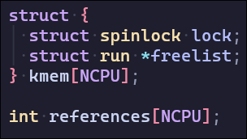

初始化`freelist`和`references`


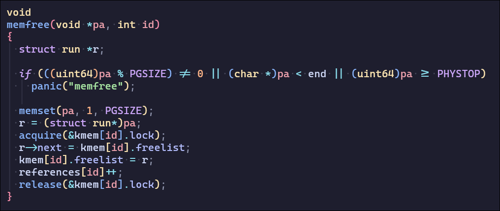

设计新的`kalloc`和`kfree`

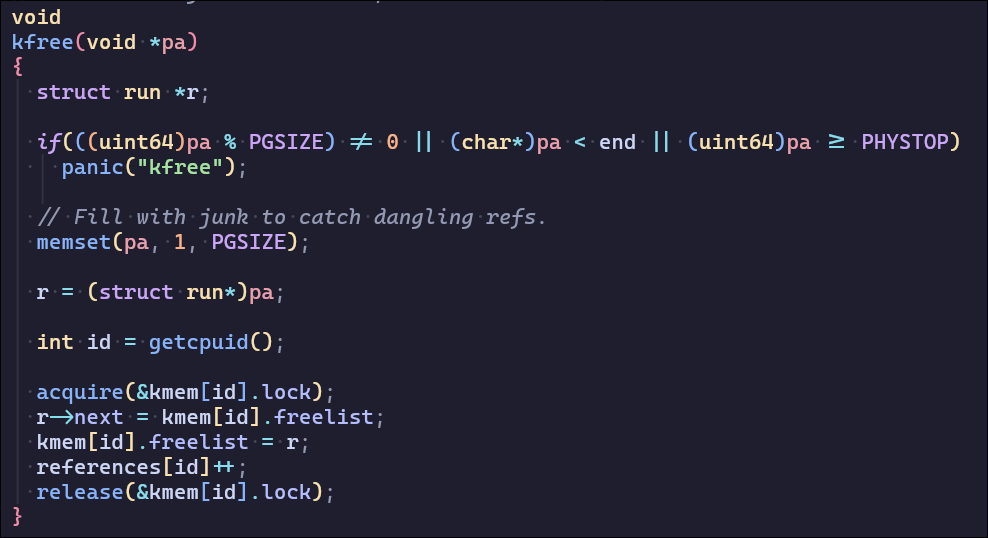

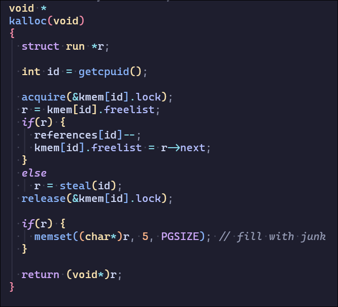

### 2.  buffer cache

这一部分需要解决buffer缓存访问的锁争用问题，这个lab官网写的比较模糊，理解起来比较困难，而且`bcachetest`不够健壮，很多隐藏问题是测试不出来的，甚至代码实现完全有问题和bug都可能过测试，建议完成后参考一下[大佬的Blog](https://blog.miigon.net/posts/s081-lab8-locks/#%E5%AE%8C%E6%95%B4%E4%BC%AA%E4%BB%A3%E7%A0%81)，下面有很多关于这个lab的讨论，检查有没有没考虑的锁争用/死锁情况

刚看这个lab和官网的介绍完全不理解如何利用存储bucket、哈希表来优化锁争用问题，我用ai帮助理解了一下：

> #### deepseek:
>
> 前实现可能使用了一个全局锁（比如bcache.lock）来保护整个缓存链表。当多个进程同时访问不同的块时，这个全局锁会成为瓶颈，导致锁竞争，从而增加acquire的迭代次数。
>
> 用户建议使用哈希桶和每个桶的锁来替代原来的全局锁。这样，不同的块可能分布到不同的桶中，每个桶有自己的锁。这样，当访问不同桶中的块时，就不会竞争同一把锁，从而减少冲突。这应该能有效降低锁的争用。
>
> 接下来，我需要修改bget和brelse函数。原来的实现可能是在全局锁的保护下遍历整个链表查找块。现在应该替换为哈希表查找，每个桶有自己的锁。这样，当查找一个块时，只需要锁住对应的桶，而不是整个缓存。
>
> 需要做的主要步骤可能有：
>
> 1. 定义哈希桶的数量，例如使用质数（如13）作为桶的数量，以减少哈希冲突。
> 2. 为每个哈希桶分配一个锁，名称以“bcache”开头，比如“bcache.bucket0”。
> 3. 在bget函数中，先根据块号计算哈希值，找到对应的桶，并获取该桶的锁。
> 4. 在该桶的链表中查找块是否存在。如果存在，则获取该buf的锁，可能增加引用计数，并释放桶锁。
> 5. 如果不存在，则需要找到一个未被使用的缓冲区（refcnt == 0）。此时可能需要遍历所有缓冲区或者有另一种方式查找。但这里可能需要处理多个桶的情况，比如遍历其他桶来寻找可替换的块。这时候可能需要获取其他桶的锁，需要注意死锁问题。
> 6. 当替换块时，可能需要将原来的buf从一个桶移动到另一个桶，这涉及到两个桶的锁，必须按顺序获取，避免死锁。例如，总是先获取旧桶的锁，再获取新桶的锁，或者按照一定的顺序获取。
>
> 原来的LRU机制需要被移除，所以brelse不需要将块移动到LRU链表。因此，brelse可能只需要修改引用计数，并在释放时不需要获取全局锁，而是可能获取对应桶的锁或者buf的锁。

总结来说，原来的缓存使用一个双端循环链表来维护，导致`buffer cache`必须使用一个全局锁，导致多进程访问缓存很容易产生锁争用，现在进行优化，将大小为NBUF的缓存分存储到N个桶，每次查找缓存只会找对应的桶，如何找对应的桶？使用哈希表(散列桶)建立映射，每个哈希表项对应一个桶，桶中存储一个链表（存储缓存），我简单地将`blockno`转化为哈希值进行映射。如果在该桶中没有找到缓存，说明在所有的桶中都不应该存在该缓存，需要在该桶中添加新的缓存（如何没有能存储`（refcnt=0）`的buf，需要从别的桶中`move buf`）。另外需要为每个桶添加锁，防止同时对桶的写入造成并发冲突，另外需要一个全局锁维护所有桶的链表结构，避免两个进程同时发起`move buf`造成环路死锁

建立哈希函数

```c
#define BUCKETS_NUM 13
#define HASH_SEATCH(blockno) (blockno % BUCKETS_NUM)  // find the bucket
```

新建立的缓存结构体

```c
struct {
  // new buffer cache
  struct spinlock lock;                     // global lock for move buf
  struct buf buf[NBUF];                     // buffer cache less than NBUF

  struct buf buckets[BUCKETS_NUM];          // use buckets to store and get cache
  struct spinlock bucketlock[BUCKETS_NUM];  // bucket lock instead of the global lock
} bcache;
```

初始化buffer cache

```c
void
binit(void)
{
  struct buf *b;

  // init global lock
  initlock(&bcache.lock, "bcache");

  // Each bucket starts with a double-ended circular linked list
  // Set head'refcnt to 1 to indicate that it cannot be moved.
  for (int i = 0; i < BUCKETS_NUM; i++) {
    initlock(&bcache.bucketlock[i], "bcachelock");
    bcache.buckets[i].next = &bcache.buckets[i];
    bcache.buckets[i].prev = &bcache.buckets[i];
    bcache.buckets[i].refcnt = 1;
  }

  // Initialize each buffer cache and store in buckets
  for (b = bcache.buf; b < bcache.buf + NBUF; b++) {
    initsleeplock(&b->lock, "buffer");
    b->next = bcache.buckets[0].next;
    b->prev = &bcache.buckets[0];
    bcache.buckets[0].next->prev = b;
    bcache.buckets[0].next = b;
  }
}
```

新的bget

```c
static struct buf*
bget(uint dev, uint blockno)
{
  struct buf *b;
  // search the bucket without global lock
  if ((b = bucketsearch(dev, blockno)) != 0)
    return b;

  acquire(&bcache.lock);
  // search the bucket with global lock
  if ((b = bucketsearch(dev, blockno)) != 0) {
    release(&bcache.lock);
    return b;
  }

  // find a buffer to move
  int new = HASH_SEATCH(blockno);
  for (int i = 0; i < BUCKETS_NUM; i++) {
    // start from the key
    int old = (new + i) % BUCKETS_NUM;
    b = bcache.buckets[old].prev;

    // search current bucket for buf
    while (b != &bcache.buckets[old]) {
      if (b->refcnt == 0) {
        // get both the old and the new bucket lock to move
        acquire(&bcache.bucketlock[old]);
        if (old != new) acquire(&bcache.bucketlock[new]);
        if ((b = bufmove(b, old, new)) != 0) {
          b->dev = dev;
          b->blockno = blockno;
          b->valid = 0;
          b->refcnt = 1;
          if (old != new) release(&bcache.bucketlock[new]); 
          acquiresleep(&b->lock);
          release(&bcache.bucketlock[old]);
          release(&bcache.lock);
          return b;
        }

        // can't reach here
        if (old != new) release(&bcache.bucketlock[new]); 
        release(&bcache.bucketlock[old]);
        release(&bcache.lock);
        panic("bget error");
      }
      b = b->prev;
    }
  }

  // can't reach here
  release(&bcache.lock);
  panic("bget: no buffers");
}
```

在对应桶中寻找buffer cache

```c
// Find the cache in the bucket corresponding to blockno
static struct buf*
bucketsearch(uint dev, uint blockno)
{
  struct buf *b;
  int key = HASH_SEATCH(blockno);

  // Accessing the bucket requires the corresponding lock
  acquire(&bcache.bucketlock[key]);
  for (b = bcache.buckets[key].next; b != &bcache.buckets[key]; b = b->next) {
    if (b->dev == dev && b->blockno == blockno) {
      b->refcnt++;
      release(&bcache.bucketlock[key]);
      acquiresleep(&b->lock);
      return b;
    }
  }
  release(&bcache.bucketlock[key]);
  return 0;
}
```

实现buffer move

```c
// move the buf from the old bucket to the new bucket
static struct buf*
bufmove(struct buf *b, int old, int new) {
  if (old == new) return b;

  // Put the buffer in the prev of new bucket head
  b->prev->next = b->next;
  b->next->prev = b->prev;
  b->next = &bcache.buckets[new];
  b->prev = bcache.buckets[new].prev;
  bcache.buckets[new].prev->next = b;
  bcache.buckets[new].prev = b;
  return b;
}
```

新的brelse，将新的buffer cache放在bucket head

```c
void
brelse(struct buf *b)
{
  if(!holdingsleep(&b->lock))
    panic("brelse");

  releasesleep(&b->lock);

  int key = HASH_SEATCH(b->blockno);
  acquire(&bcache.bucketlock[key]);
  b->refcnt--;
  if (b->refcnt == 0) {
    // Put the buffer in the next of new bucket head for quicker search
    struct buf *head = &bcache.buckets[key];
    b->prev->next = b->next;
    b->next->prev = b->prev;
    b->next = head->next;
    head->next->prev = b;
    head->next = b;
    b->prev = head;
  }
  release(&bcache.bucketlock[key]);
}
```

修改`bpin`和`bupin`的lock

```c
void
bpin(struct buf *b) {
  int key = HASH_SEATCH(b->blockno);
  acquire(&bcache.bucketlock[key]);
  b->refcnt++;
  release(&bcache.bucketlock[key]);
}

void
bunpin(struct buf *b) {
  int key = HASH_SEATCH(b->blockno);
  acquire(&bcache.bucketlock[key]);
  b->refcnt--;
  release(&bcache.bucketlock[key]);
}
```

## Lab8. Fs

### 1. large files

这个部分需要修改`bmap`来支持大文件，`bmap`在`readi`和`writei`中调用，返回读取或写入的数据块，如果没有分配则需要在`inode`的`addr`中加入指针指向数据块。

原来`inode`有13个地址指针，其中12个直接指向数据块，第13个个指向block，并进行一次映射BSIZE / sizeof(uint)个指针。现在需要支持large file，将原来的一个直接映射指针转变为二次映射指针。

修改NDIRECT的定义，增加NDBDIRECT的定义，对应修改inode的结构体

```c
#define NDIRECT 11
#define NINDIRECT (BSIZE / sizeof(uint))
#define NDBINDIRECT ((BSIZE / sizeof(uint)) * (BSIZE / sizeof(uint)))
#define MAXFILE (NDIRECT + NINDIRECT + NDBINDIRECT)
// On-disk inode structure
struct dinode {
  short type;           // File type
  short major;          // Major device number (T_DEVICE only)
  short minor;          // Minor device number (T_DEVICE only)
  short nlink;          // Number of links to inode in file system
  uint size;            // Size of file (bytes)
  uint addrs[NDIRECT+2];   // Data block addresses
};
```

修改bmap的实现，增加二次映射的部分

`addrs[NDIRECT+1]`指向第一个block，不同于`addrs[NDIRECT]`block的指针直接指向数据块，这里的block需要继续分配指针指向新的block，一共分配`256 x 256`的数据块

```c
bn -= NINDIRECT;

if (bn < NDBINDIRECT) {
    if ((addr = ip->addrs[NDIRECT+1]) == 0) {
      addr = balloc(ip->dev);
      if (addr == 0) return 0;
      ip->addrs[NDIRECT+1] = addr;
    }
    for (int level = 2; level > 0; level--) {
      int n = (level == 2 ? bn / NINDIRECT : bn % NINDIRECT);
      bp = bread(ip->dev, addr);
      a = (uint *)bp->data;
      if ((addr = a[n]) == 0) {
        addr = balloc(ip->dev);
        if (addr) {
          a[n] = addr;
          log_write(bp);
        } else return 0;
      }
      brelse(bp);
    }
    return addr;
}
panic("bmap: out of range");
```

### 2. symbolic links

这一部分需要实现sys_symlink系统调用实现软链接，类似于`ln -s`

首先将参数解析近target和path，并开启日志记录，然后给链接的目标`path`创建inode，同时向inode的数据块写入链接的文件名

```c
uint64
sys_symlink(void)
{
  char path[MAXPATH];
  char target[MAXPATH];
  struct inode *ip;
  int n, r;

  if ((n = argstr(0, target, MAXPATH)) < 0)
    return -1;
  if ((n = argstr(1, path, MAXPATH)) < 0)
    return -1;

  begin_op();

  ip = create(path, T_SYMLINK, 0, 0);

  if (ip == 0) {
    end_op();
    return -1;
  }

  if ((r = writei(ip, 0, (uint64)target, 0, strlen(target)+1)) < strlen(target)+1) {
    iunlockput(ip);
    end_op();
    return -1;
  }
  
  iunlockput(ip);
  end_op();
  return 0;
}
```

修改sys_open系统调用，使其能够处理类型为`T_Symlink`的文件

```c
int depth = 0;
while (ip->type == T_SYMLINK && !(omode & O_NOFOLLOW)) {
    int r = 0;
    char addr[MAXPATH];
    if ((r = readi(ip, 0, (uint64)addr, 0, MAXPATH)) <= 0) {
      iunlockput(ip);
      end_op();
      return -1; 
    }
    iunlockput(ip);
    if ((ip = namei(addr)) == 0) {
      end_op();
      return -1;
    }
    ilock(ip);
    if (++depth > 9) {
      iunlockput(ip);
      end_op();
      return -1;
    }
}

```

## Lab9. mmap

 又是一个单独的hard lab，这些单列的hard lab都颇具挑战

这个lab需要实现`mmap`系统调用和`munmap`系统调用，`mmap`系统调用用于将文件的数据块虚拟化为内存，让用户可以直接读写内存来模拟实现读取文件，实现的细节很多，后面直接变成面向test debug了

具体实现和相关语句的作用直接写在注释里：

开始的时候我把vma相关的用户内存从低地址开始寻找，但是由于低地址不仅存放fork后父进程的页表数据，而且再往上是向下生长的栈，会发生不可预知的错误。所以vma的地址设置在用户内存的最高处（trapframe下

```c
uint64
sys_mmap(void)
{
  int index;
  int fd;
  uint64 va;
  struct VMA vma;
  struct proc *p = myproc();

  // get args
  argaddr(0, &vma.addr);
  argint(1, &vma.len);
  vma.len = PGROUNDUP(vma.len);
  argint(2, &vma.prot);
  argint(3, &vma.flags);
  if (argfd(4, &fd, &vma.f) < 0)
    return -1;
  argint(5, &vma.offset);

  // check prot and flags
  // 如果设置为MAP_SHARED需要检查该文件是否能够读入
  if (!(vma.flags & MAP_PRIVATE) && ((!vma.f->readable && (vma.prot & PROT_READ)) 
    || (!vma.f->writable && (vma.prot & PROT_WRITE))))
    return -1;

  // find a vma to store
  for (index = 0; index < NVMA; index++)
    if (!p->vmas[index].len) break;
  if (index == NVMA) panic("sys_mmap: no VMA to free");
  p->vmas[index] = vma;
  // 增加文件的ref计数
  filedup(p->vmas[index].f);

  // find a va space to map
  for (va = VMABASE; va > 0; va -= PGSIZE) {
    if ((walkaddr(p->pagetable, va)) != 0) continue;

    // 检查再往下的内存是否被map
    uint64 vaend = va;
    for (; va > vaend - vma.len; va -= PGSIZE)
      if ((walkaddr(p->pagetable, va)) != 0) break;

    // 检查这里的内存是否是未被加载的vma
    if (va == vaend - vma.len && conflictdet(p->vmas, va + PGSIZE, vma.len)) {
      p->vmas[index].addr = va + PGSIZE;
      p->vmas[index].base = va + PGSIZE;    // base需要用于之后写入文件
      break;
    }
  }

  if (p->vmas[index].addr) return p->vmas[index].addr;
  else return -1;
}
```

检查va是否与存在的vma产生冲突

```c
int
conflictdet(struct VMA *vmas, uint64 va, int len)
{
  for (int i = 0; i < NVMA; i++) {
    if (vmas[i].len) {
      uint64 left = vmas[i].addr;
      uint64 right = vmas[i].addr + vmas[i].len;
      if (va < right && va+len >= left)
        return i;
    }
  }
  return -1;
}
```

再读入scause为13和15时处理page fault

```c
int
pagefaulthandler(uint64 fault_addr)
{
  int n;
  uint64 va;
  uint64 pa;
  char *mem;
  struct VMA *vma;
  struct proc *p = myproc();

  // 检查fault_addr是否位于vma内存区域
  int index;
  if ((index = conflictdet(p->vmas, fault_addr, 0)) == -1) {
    printf("page fault: addr not assigned\n");
    return -1;
  }
  vma = &p->vmas[index];
  va = PGROUNDDOWN(fault_addr);
  
  // 如果已被映射但仍触发page fault可能是尝试写入不可写页面
  if ((pa = walkaddr(p->pagetable, fault_addr)) != 0) 
    if (!(PA2PTE(pa) & PTE_W))
      return -1;

  if ((mem = kalloc()) == 0) {
    printf("page fault: Page Fault: no free memory\n");
    return -1;
  }
  memset(mem, 0, PGSIZE);

  // 进行file的操作需要持有锁
  // 将file的内存读入物理内存
  ilock(vma->f->ip);
  if ((n = readi(vma->f->ip, 0, (uint64)mem, vma->offset + va - vma->addr, PGSIZE)) < 0) {
    printf("page fault: read file fail\n");
    iunlock(vma->f->ip);
    return -1;
  }
  iunlock(vma->f->ip);
  
  // 将va映射到pa
  // prot与PTE的权限存在`<<1`的关系
  if (mappages(p->pagetable, va, PGSIZE, (uint64)mem, PTE_U | (vma->prot << 1)) != 0) {
    kfree(mem);
    printf("Page Fault: mmap map fault\n");
    return -1;
  }
  return 0;
}
```

实现munmap系统调用，关于offset有一些ideal的假设，比如不会释放一段vma中间的内存

```c
uint64 
sys_munmap(void)
{
  int length;
  int writelen;
  int index;
  uint64 addr;
  uint64 writeaddr;
  struct VMA *vma;
  struct inode *ip;
  struct proc *p = myproc();

  argaddr(0, &addr);
  argint(1, &length);
  if ((index = conflictdet(p->vmas, addr, 0)) == -1)
    panic("munmap: not assigned addr");
  vma = &p->vmas[index];
  ip = vma->f->ip;

  // 检查写入的长度和地址是否会导致写入多余内存(分配时向上PGROUNDUP，存在部分内存不应被使用)
  writelen = addr - vma->base + vma->offset + length > ip->size ?
  (ip->size - (addr - vma->base + vma->offset)) : length;
  if (writelen < 0) writelen = 0;
  writeaddr = vma->offset + addr - vma->base > ip->size ? 
  (vma->offset) : vma->offset + addr - vma->base;

  if (vma->flags & MAP_SHARED) {
    // 在fs_system call 前调用begin_op
    begin_op();
    ilock(ip);
    if ((writei(ip, 1, addr, writeaddr, writelen)) < 0) {
      iunlock(ip);
      end_op();
      printf("writelen:%d\n", writelen);
      panic("mumap: write back error");
    }
    iunlock(ip);
    end_op();
  }

  vmaunmap(p->pagetable, addr, PGROUNDUP(length) / PGSIZE, 1);
  vma->len -= PGROUNDUP(length);
  if (vma->len) {
    if (addr == vma->addr)
      vma->addr += PGROUNDUP(length);
  } else
    fileclose(vma->f);
  return 0;
}
```

在fork时将父进程的vma信息复制到子进程，简单考虑，他们没有共享页面，且由于映射在高地址处，不会受uvmcopy影响

```c
for (i = 0; i < NVMA; i++) {
    vma = &p->vmas[i];
    if (vma->len) {
      np->vmas[i] = *vma;
      filedup(vma->f);
    }
}
```

exit时释放vma的资源

```c
for (; vma <= &p->vmas[NVMA-1]; vma++) {
    if (vma->len) {
      vmaunmap(p->pagetable, vma->addr, PGROUNDUP(vma->len) / PGSIZE, 1);
      fileclose(vma->f);
      vma->len = 0;
    }
}
```

还会有更多的细节，notes里也做不到面面俱到，上手调试才能感受到...

